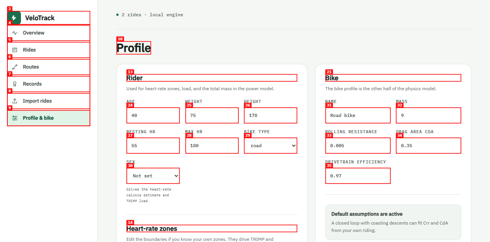
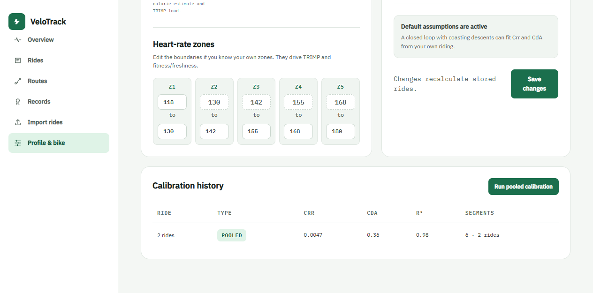
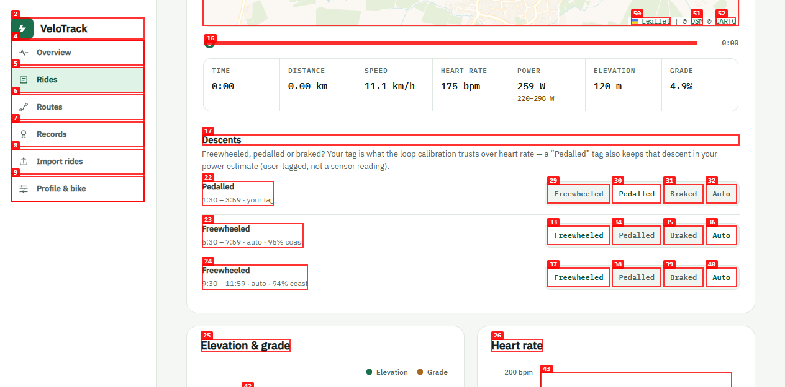
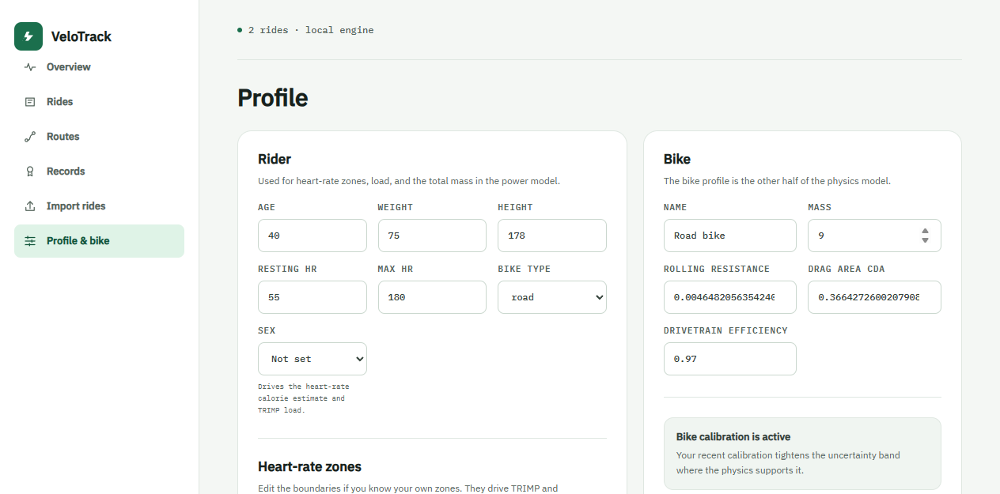
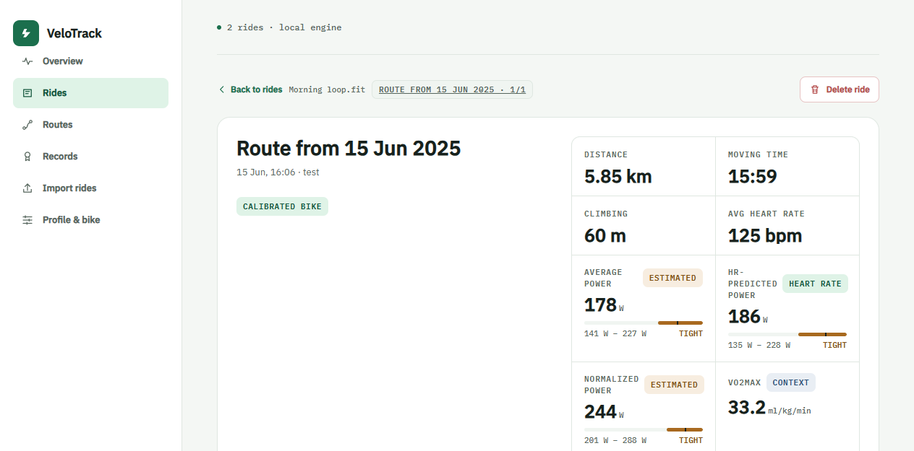

# Dogfood Report: Cycling Progress Tracker (VeloTrack)

| Field | Value |
|-------|-------|
| **Date** | 2026-08-19 |
| **App URL** | http://127.0.0.1:8347 |
| **Session** | cycling-qa2 |
| **Scope** | New Phase 2 (pooled cross-ride calibration + Profile button) and Phase 3 (pedalled-descent power recovery) UI |

## Summary

| Severity | Count |
|----------|-------|
| Critical | 0 |
| High | 0 |
| Medium | 2 |
| Low | 1 |
| **Total** | **3** |

## Issues

### ISSUE-001: Profile bike form stays stale after a pooled calibration

| Field | Value |
|-------|-------|
| **Severity** | medium |
| **Category** | functional / ux |
| **URL** | http://127.0.0.1:8347/#/profile |
| **Repro Video** | N/A |

**Description**

Clicking "Run pooled calibration" applies the fit server-side and refreshes the **Calibration history** table, but the **Bike** form fields (Rolling resistance, Drag area CdA) and the status note keep showing the old "Default assumptions are active" state. The server has already updated the bike (`crr=0.00473`, `cdA=0.359`, `calibrated=1`), so the visible form is wrong until the page is reloaded.

**Repro Steps**

1. Navigate to the Profile page.
   

2. Click "Run pooled calibration" and wait for the history table to update.
   

3. **Observe:** the history table shows `pooled · Crr 0.0047 · CdA 0.36`, but the form above still reads `0.0050` / `0.35` and "Default assumptions are active".
   

---

### ISSUE-002: Tagging a descent blocks the UI for ~10-14s

| Field | Value |
|-------|-------|
| **Severity** | medium |
| **Category** | performance / ux |
| **URL** | http://127.0.0.1:8347/#/ride/1 |
| **Repro Video** | N/A |

**Description**

Clicking a descent tag (Freewheeled / Pedalled / Braked) POSTs synchronously and re-runs the pooled cross-ride fit plus a full recalculation of every ride inside the request. The clicked button stays disabled for ~10-14 seconds before the "your tag" state appears, with no progress indication. The same action was near-instant before the pooled trigger was added.

**Repro Steps**

1. Open a ride with descents and scroll to the Descents section.
   

2. Click "Pedalled" on the first descent.

3. **Observe:** the button remains disabled for ~12s, then the row flips to "Pedalled … your tag" (the tag itself persists correctly).
   

---

### ISSUE-003: Calibration history accumulates near-duplicate pooled entries

| Field | Value |
|-------|-------|
| **Severity** | low |
| **Category** | ux |
| **URL** | http://127.0.0.1:8347/#/profile |
| **Repro Video** | N/A |

**Description**

Each import and each descent tag re-runs the pooled fit and appends a new calibration batch (plus a climb diagnostic row), so the Calibration history table grows with near-identical pooled rows over time — e.g. after one tag the API returns two pooled entries (`0.00473 / 6 segments` and `0.00474 / 5 segments`) plus a climb row.

---

## Fix verification (2026-08-19)

Two regressions were fixed in-repo and re-verified through the real surface.

### Fix for ISSUE-001 — stale bike form

`web/app.js` gained `refreshBikeFields(bikeRef)`, which after a pooled fit re-reads `/api/profile` and updates the Bike form's Crr/CdA inputs, the calibration note, **and** the in-memory `bike` object used by the save handler (its `crr`, `cdA`, `calibrated` fields).

**Verified:**

1. Opened Profile (`#/profile`). Bike form already showed the pooled values (`Crr 0.004729`, `CdA 0.359117`) and "Bike calibration is active".
2. Clicked "Run pooled calibration" → form stayed in step (still pooled values + active note).
3. Clicked "Save changes" → API confirmed the bike was **not** clobbered: `{'crr': 0.004729, 'cdA': 0.359117, 'calibrated': 1}` (previously a save would reset `calibrated` back to `0` because the handler read a stale `bike.calibrated`).

### Fix for ISSUE-002 — tagging blocked the UI

`cycling/server.py` moved the pooled re-fit + full recalculation off the request thread: the tag and that ride's synchronous loop re-fit stay in the request, and the cross-ride pool refresh runs in a `threading.Thread(daemon=True)`.

**Verified:**

1. `POST /api/rides/1/coast_segments` now returns in **~2s** (was ~12s), with the pooled re-fit completing in the background afterwards.
2. Through the browser, clicking "Pedalled" flipped the row to "Pedalled … your tag" and showed the "Pedalled tag saved." toast without the multi-second freeze.

### Not fixed (out of scope)

**ISSUE-003** (duplicate pooled history rows) is a low-severity UX nit, not a regression; it was left as-is per the "fix only what QA uncovers, don't redesign" scope. A future change could dedupe/collapse pooled batches in `list_calibrations` or only append when params actually change.

### Suites after fixes

- `tests/verify_backend.py` — **All backend checks passed** (incl. `manual tag`, `learned classifier`, `pedal tag power`, `pooled calibration`).
- `tests/physics_eval.py` — **GATE: PASS** (M1–M16 + F1–F7).
- `node --check web/app.js` — clean.
- Browser console/errors — empty (no JS errors during the profile and ride flows).
